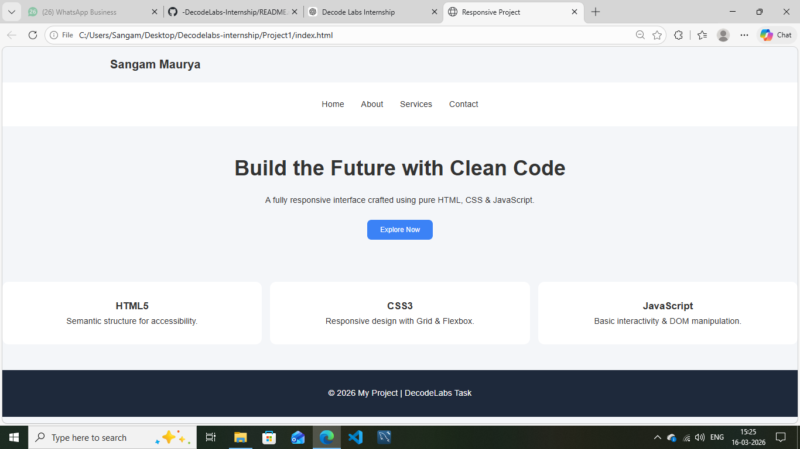

# 🚀 Responsive Web Interface

## 🖼 Project Preview

## 📌 Project Overview
A fully responsive web interface built using **HTML, CSS, and JavaScript** as part of my **Full Stack Development Internship at DecodeLabs**.  
The project demonstrates **semantic HTML structure, modern CSS layout techniques, and basic JavaScript interactivity**.

## ✨ Features
- Semantic **HTML5** structure  
- **Responsive design** for mobile, tablet, and desktop  
- Layout using **CSS Grid & Flexbox**  
- **JavaScript popup interaction**  
- Clean and modern UI  

## 🛠 Tech Stack
- HTML5  
- CSS3  
- JavaScript  

## 🌐 Live Demo
https://sangam-responsive-task.netlify.app/

## 💻 GitHub Repository
https://github.com/Sangam200414/responsive-frontend-task

## 👨‍💻 Author
**Sangam Maurya**

🔗 Portfolio: https://sangam-maurya-portfolio.netlify.app/  
🔗 GitHub: https://github.com/Sangam200414
